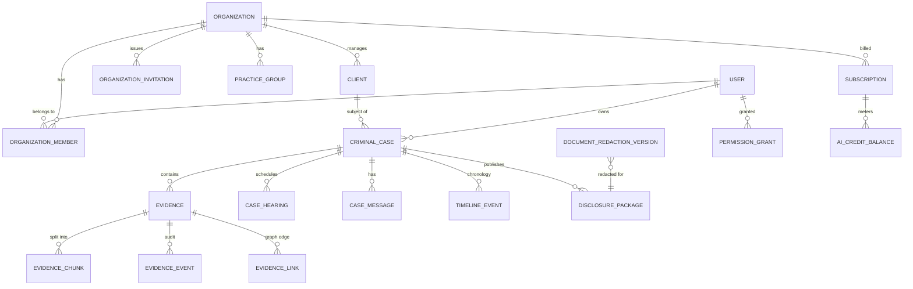

# Database Certification Report (Program 36)

**Target:** `backend/prisma/schema.prisma` (PostgreSQL, Prisma 6.19.2).
**Method:** static analysis + offline Prisma tooling (`validate`, `migrate diff --from-empty`).
No live database was available, so record-level checks (orphans, dead rows) are
flagged as **requires-DB**. All schema/migration findings are reproducible.

**Generated:** 2026-07-06.

---

## 1. Schema overview (evidence)

| Metric | Value | Source |
|--------|-------|--------|
| Models | 103 | `rg -c "^model " schema.prisma` |
| Mapped tables (`@@map`) | 102 | `rg -c "@@map"` |
| `@@index` declarations | 308 | `rg -c "@@index"` |
| Field `@unique` | 30 | `rg -c "@unique"` |
| `@@unique` composite | 16 | `rg -c "@@unique"` |
| Relations (`@relation`) | 50 | `rg -c "@relation"` |
| `onDelete` rules | 16 | `rg -c "onDelete"` |
| Soft-delete fields (`deletedAt`) | 2 | `rg -c "deletedAt"` |
| **Schema validity** | ✅ **VALID** | `DATABASE_URL=… prisma validate` → "valid 🚀" |
| Full DDL (from empty) | 103 tables, **338 indexes**, **48 FK constraints** | `prisma migrate diff --from-empty --script` |

---

## 2. Migration audit — **DRIFT FOUND**

**Migrations present (7):**
1. `20260308130109_corpus_governance_layer`
2. `20260309143552_add_policy_taxonomy_system`
3. `20260309154000_add_cpra_tables`
4. `20260309162000_add_cpra_annual_updates`
5. `20260312194705_autonomous_cpra_system`
6. `20260314164356_add_persistence_models`
7. `20260315175413_persistence_layer_models`

**Coverage:** migrations create **73** of the schema's **102** tables.

### ⚠️ 29 tables have a model but NO migration (schema drift)

`prisma migrate deploy` on a fresh database would **not** create these tables. They
were introduced into `schema.prisma` and applied with `prisma db push` (a `db:push`
script exists) rather than a committed migration:

```
approval_requests            organization_departments
case_hearings                organization_invitations
case_messages                organization_members
clients                      organization_offices
client_team_assignments      organizations
conflict_records             org_internal_messages
disclosure_packages          org_tasks
document_copies              password_reset_tokens
document_redaction_versions  permission_grants
email_verification_tokens    personnel_profiles
evidence_request_responses   practice_groups
evidence_requests            publication_audit_logs
knowledge_assets             publication_set_items
legislative_extraction_audit publication_sets
                             user_account_settings
```

**Impact:** this is the schema half of **BLK-003** (multi-org membership, auth tokens,
permission grants, disclosure/redaction/publication engine, account settings not in
migration history). It is a **release blocker** — a greenfield deploy via
`migrate deploy` produces an incomplete database.

**Remediation (requires a database or shadow DB — not runnable in this env):**
```bash
# Generate the reconciling migration from committed migrations → current schema:
cd backend
npx prisma migrate diff \
  --from-migrations ./prisma/migrations \
  --to-schema-datamodel ./prisma/schema.prisma \
  --shadow-database-url "$SHADOW_DATABASE_URL" \
  --script > prisma/migrations/<ts>_reconcile_membership_publication/migration.sql
# Review, then: npx prisma migrate deploy
```
Do **not** hand-write these 29 tables — let Prisma generate the exact DDL so it
matches the schema (no drift, correct FK ordering, indexes).

---

## 3. Indexes, foreign keys, constraints

| Item | Finding |
|------|---------|
| Indexes | **338** in generated DDL (308 `@@index` + unique). Strong coverage. |
| Foreign keys | **48** FK constraints generated. |
| Unique constraints | 30 field-level + 16 composite. |
| **FK-column indexing** | **VERIFY** — PostgreSQL does not auto-index FK columns. With 48 FKs vs 338 indexes coverage is likely good, but confirm each FK column used in joins has a supporting index (audit `@relation` fields vs `@@index`). |

---

## 4. Cascade rules — **GAP**

Only **16 `onDelete` rules across 50 relations** → **~34 relations use the Prisma
default referential action** (implicit). For a multi-tenant legal system, deletion
behavior must be explicit to avoid orphaned children or blocked deletes.

**Recommendation:** annotate every `@relation` with an explicit `onDelete`
(`Cascade` for owned children like evidence chunks/events; `Restrict`/`SetNull` for
references). Tenant-scoped children of `criminal_cases`/`organizations` should
`Cascade`; audit/log tables should `Restrict` (never lose audit history).

---

## 5. Soft deletes — **GAP**

Only **2** `deletedAt` occurrences → the platform is effectively **hard-delete**.
For an evidence-governed system, destructive deletes of cases/evidence/audit records
are risky and may violate retention/audit requirements.

**Recommendation:** introduce a soft-delete convention (`deletedAt DateTime?` +
partial indexes `WHERE deleted_at IS NULL`) for `criminal_cases`, `evidence`,
`clients`, disclosure/publication tables; never hard-delete audit/log tables.

---

## 6. Audit tables (present — good)

14 audit/log/event models exist:
`SecurityLog`, `CorpusIngestionLog`, `LegislativeExtractionAudit`, `CpraRequestLog`,
`EvidenceEvent`, `ComplianceAuditTrail`, `VisionEvent`, `CpraEmailLog`,
`CpraTimelineEvent`, `NormalizedClaimEvent`, `TimelineEvent`, `MarketingEvent`,
`StripeWebhookEvent`, `PublicationAuditLog`.

**Note:** `PublicationAuditLog`, `ComplianceAuditTrail`, `LegislativeExtractionAudit`
are among the 29 **un-migrated** tables — audit persistence is at risk on greenfield
deploy until the reconcile migration lands.

---

## 7. Unused / duplicate / orphaned — **requires-DB**

| Check | Status |
|-------|--------|
| Unused tables (zero rows / no code refs) | **requires-DB** + code cross-ref; not run |
| Duplicate tables | None found by name; `cpra_requests_v2` suggests a superseded `cpra_requests` — **verify** the v1 table/model is retired |
| Orphaned records (FK integrity) | **requires-DB** — run `SELECT` FK-orphan checks post-deploy |
| Repository integrity | `RepositoryIntegrityDashboard` + `ComplianceAuditTrail` exist; live verification pending deploy |

---

## 8. Performance recommendations

1. **Close the 29-table migration gap** (Section 2) — highest priority; blocks clean deploy.
2. **Explicit `onDelete`** on all 50 relations (Section 4).
3. **Verify FK-column indexes** exist for every join path (Section 3).
4. **Soft-delete + partial indexes** for evidence-governed retention (Section 5).
5. **Composite indexes for tenant scoping** — confirm `(tenantId, …)` leading-column
   indexes on high-volume tables (`evidence`, `criminal_cases`, timeline/event tables).
6. **Audit tables:** append-only; add `Restrict` on delete and time-based indexes.
7. Add a **CI schema-drift gate**: `prisma migrate diff --exit-code` (migrations vs
   schema) so drift like this fails the build (a `db:schema:check` script already exists —
   wire it to this diff).

---

## 9. Schema diagram (core domains)


*(Domain-level; the full generated DDL has 103 tables / 338 indexes / 48 FKs.)*

---

## 10. Completion (not inflated)

| Workstream | Status | % |
|------------|--------|---|
| Schema validity | ✅ Valid | 100% |
| Index coverage | Strong (338) | ~90% |
| Migration coverage | **73/102 tables** | **72%** |
| Explicit cascade rules | 16/50 relations | 32% |
| Soft-delete strategy | 2 fields | ~5% |
| Audit tables present | 14 models | 100% (but 3 un-migrated) |
| Record-level integrity (orphans/unused) | requires-DB | 0% |

**Database certification: ≈ 68%.**
The schema is valid and well-indexed, but **certification is DENIED** until the
**29-table migration drift (BLK-003) is reconciled** — that is the single blocking
finding. Cascade-rule and soft-delete gaps are strong recommendations, not blockers.

---

## 11. Reproduce

```bash
cd backend
rg -c "^model " prisma/schema.prisma
DATABASE_URL=postgresql://u:p@localhost/db npx prisma validate
npx prisma migrate diff --from-empty --to-schema-datamodel ./prisma/schema.prisma --script | rg -c "CREATE TABLE"
# drift set:
cat prisma/migrations/*/migration.sql | rg -o 'CREATE TABLE "([^"]+)"' -r '$1' | sort -u > /tmp/mig.txt
rg -o '@@map\("([^"]+)"\)' -r '$1' prisma/schema.prisma | sort -u > /tmp/schema.txt
comm -23 /tmp/schema.txt /tmp/mig.txt   # 29 tables without migrations
```
