# NIIS — entity relationship diagram

The permanent structural reference. Nineteen tables, all prefixed `inmate` in the
database. Every relationship, constraint, index and cascade rule that exists is
listed here; if something is not here it does not exist in the schema.

Generated against migration **33** (`inmate_intelligence_index_review`). When the
schema changes, this document changes in the same commit.

---

## 1 · Diagram

```mermaid
erDiagram
    InmateFacility ||--o{ InmateSourceDocument : "code → facilityCode (RESTRICT)"
    InmateSourceDocument ||--o{ InmateIngestionBatch : "documentId (SET NULL)"

    InmateIngestionBatch ||--o{ InmateIngestionRecord : "batchId (CASCADE)"
    InmateIngestionBatch ||--o{ InmateIngestionIssue : "batchId (CASCADE)"
    InmateIngestionBatch ||--o{ InmateBooking : "sourceBatchId (RESTRICT)"
    InmateIngestionBatch ||--o{ InmateAlias : "sourceBatchId (SET NULL)"

    Inmate ||--o{ InmateAlias : "inmateId (CASCADE)"
    Inmate ||--o{ InmateBooking : "inmateId (CASCADE)"
    Inmate ||--o{ InmateWatchListEntry : "inmateId (CASCADE)"
    Inmate |o..o| Inmate : "mergedIntoId (soft, no FK)"

    InmateBooking ||--o{ InmateBookingCharge : "bookingId (CASCADE)"
    InmateBooking ||--o{ InmateBookingObservation : "bookingId (CASCADE)"

    InmateWatchListEntry ||--o{ InmateWatchListMatch : "entryId (CASCADE)"

    InmateIngestionRecord |o..|| InmateIdentityMatch : "importRecordId (soft)"
    InmateIngestionRecord |o..o| InmateReviewQueueItem : "importRecordId (soft, unique)"
    InmateBookingObservation |o..o{ InmateSourceConflict : "observationAId / observationBId (soft)"
    InmateBookingObservation |o..o{ InmateChangeEvent : "observationId (soft)"

    InmateFacility {
        string facilityId PK
        string code UK
        string name
        string county
        bool rostersAreFullPopulation
        bool active
    }
    InmateSourceDocument {
        string documentId PK
        string sha256 UK
        string filename
        bigint byteSize
        string mediaType
        string facilityCode FK
        datetime rosterDate
        string storagePath
        int pageCount
        json pageStats
        string receivedById
    }
    InmateIngestionBatch {
        string batchId PK
        string documentId FK
        string sourceType
        string sourceSha256
        string facility
        datetime rosterDate
        string rosterKind
        string status
        int recordsTotal
        int recordsNew
        int recordsMatched
        int recordsDuplicate
        int recordsForReview
        int recordsFailed
        int resumeCursor
        json extractionStats
        string triggeredBy
        string ingestedById
    }
    InmateIngestionRecord {
        string recordId PK
        string batchId FK
        int lineNumber
        json rawPayload
        json normalizedPayload
        string resolution
        string resolvedInmateId
        string bookingId
        int confidence
        string matchTier
        json matchEvidence
        int sourcePage
        string extractionMethod
        int extractionConfidence
    }
    InmateIngestionIssue {
        string issueId PK
        string batchId FK
        int lineNumber
        string severity
        string code
        string message
    }
    Inmate {
        string inmateId PK
        string canonicalFirst
        string canonicalLast
        string canonicalMiddle
        string suffix
        datetime dateOfBirth
        string sex
        string race
        datetime firstSeenAt
        datetime lastSeenAt
        int bookingCount
        int identityConfidence
        json mergeEvidence
        string mergedIntoId
        string mergedById
    }
    InmateAlias {
        string aliasId PK
        string inmateId FK
        string first
        string last
        string middle
        string suffix
        datetime dateOfBirth
        string sourceBatchId FK
        int occurrences
    }
    InmateBooking {
        string bookingId PK
        string inmateId FK
        string facility
        string externalBookingId
        datetime bookedAt
        datetime releasedAt
        string arrestingAgency
        bigint bailAmountCents
        string housingLocation
        string contentHash UK
        string sourceBatchId FK
        string sourceRecordId
        bool isFirstAppearance
        string custodyStatus
        datetime courtDate
        datetime lastObservedAt
        datetime departedRosterAt
    }
    InmateBookingCharge {
        string chargeId PK
        string bookingId FK
        string statuteCode
        string statuteSection
        string description
        string severity
        int counts
        bigint bailAmountCents
        string rawText
    }
    InmateBookingObservation {
        string observationId PK
        string bookingId FK
        string batchId
        string documentId
        string sourceType
        int sourcePage
        int sourceRow
        datetime rosterDate
        string housingLocation
        bigint bailAmountCents
        datetime releasedAt
        datetime courtDate
        string custodyStatus
        string chargeSetHash
        int chargeCount
        datetime observedAt
    }
    InmateIdentityMatch {
        string matchId PK
        string importRecordId
        string inmateId
        string tier
        int confidence
        string outcome
        bool humanReviewRequired
        string reviewRationale
        string resolverVersion
        json reasons
        json conflicts
        json rejectedCandidates
        json sourceDocuments
        datetime decidedAt
    }
    InmateReviewQueueItem {
        string reviewId PK
        string importRecordId UK
        string matchId
        string batchId
        string status
        string reason
        int confidence
        string candidateInmateId
        string resolvedById
        string resolutionNote
    }
    InmateSourceConflict {
        string conflictId PK
        string bookingId
        string inmateId
        string field
        string valueA
        string sourceA
        string observationAId
        string valueB
        string sourceB
        string observationBId
        datetime rosterDate
        string resolution
        string resolvedById
        string resolutionNote
        string batchId
    }
    InmateChangeEvent {
        string eventId PK
        string inmateId
        string bookingId
        string batchId
        string changeType
        string field
        string previousValue
        string newValue
        bool material
        string observationId
        datetime rosterDate
        datetime detectedAt
    }
    InmateWatchListEntry {
        string entryId PK
        string inmateId FK
        string createdById
        string reason
        bool active
        bool notifyOnRebooking
        datetime deactivatedAt
    }
    InmateWatchListMatch {
        string matchId PK
        string entryId FK
        string inmateId
        string bookingId
        string batchId
        string matchType
        datetime rosterDate
        string acknowledgedById
    }
    InmateNotification {
        string notificationId PK
        string kind
        string severity
        string title
        string body
        string inmateId
        string batchId
        string referenceId
        string readById
        datetime readAt
    }
    InmateIntelligenceReport {
        string reportId PK
        string reportType
        json parameters
        int rowCount
        string renderedHtml
        string generatedById
        datetime generatedAt
    }
    InmateAccessLog {
        string logId PK
        string userId
        string action
        string inmateId
        string batchId
        json parameters
        int resultCount
        string ipAddress
    }
```

## 2 · Cardinality

| Relationship | Cardinality | Note |
|---|---|---|
| Facility → SourceDocument | 1 : N | A facility supplies many rosters |
| SourceDocument → IngestionBatch | 1 : N | **The same document may be processed more than once.** This is why the document is not the batch: a resumed or re-run import is a second batch over the same bytes |
| IngestionBatch → IngestionRecord | 1 : N | One record per parsed row |
| IngestionBatch → IngestionIssue | 1 : N | Per-row problems that did not stop the batch |
| IngestionBatch → Booking | 1 : N | Bookings first created by that batch |
| Inmate → Alias | 1 : N | Every spelling ever observed |
| Inmate → Booking | 1 : N | The arrest timeline |
| Booking → Charge | 1 : N | |
| Booking → Observation | 1 : N | **The many-to-many in disguise:** many sources describe many bookings, and an observation is the join row carrying what each said |
| WatchListEntry → WatchListMatch | 1 : N | |
| IngestionRecord → IdentityMatch | 1 : 1 | Written together in one transaction |
| IngestionRecord → ReviewQueueItem | 1 : 0..1 | Unique — a row cannot be queued twice |
| Observation → SourceConflict | N : M | A conflict names two observations |

There is no `@relation` many-to-many table. The one conceptual many-to-many —
sources describing bookings — is `InmateBookingObservation`, which is a first-class
entity because it carries what was said, not merely that a link exists.

## 3 · Unique constraints

| Table | Constraint | Why |
|---|---|---|
| `inmate_facilities` | `code` | The handle used on the command line and in column maps |
| `inmate_source_documents` | `sha256` | **The identity of a document is its bytes.** Re-uploading the same file finds the same row |
| `inmate_bookings` | `contentHash` | **The idempotence key of the whole system.** Re-ingesting a roster cannot create a second copy of a booking |
| `inmate_review_queue` | `importRecordId` | One row cannot be queued for review twice |
| `inmate_watch_list_entries` | `(inmateId, createdById)` | One administrator, one entry per person |
| `inmate_aliases` | `(inmateId, last, first, middle, dateOfBirth)` | Intended to prevent duplicate aliases — **but see the warning below** |

> **The alias unique constraint does not fire when `middle` or `dateOfBirth` is
> null.** In PostgreSQL two NULLs are distinct, so a person with no middle name
> has an unconstrained natural key. The ingestion engine therefore does
> find-then-write rather than `upsert`; the constraint is a backstop for the
> fully-populated case only. Relying on it for correctness would insert a new
> alias on every roster for anyone missing a middle name.

## 4 · Cascade rules

| Parent → child | On delete | Reasoning |
|---|---|---|
| `Inmate` → `InmateAlias` | **CASCADE** | An alias has no meaning without its person |
| `Inmate` → `InmateBooking` | **CASCADE** | Deliberate, and deliberately never used: nothing in the application deletes an inmate. A merge sets `mergedIntoId`. The cascade exists so a manual correction cannot leave orphans |
| `Inmate` → `InmateWatchListEntry` | **CASCADE** | |
| `InmateBooking` → `InmateBookingCharge` | **CASCADE** | |
| `InmateBooking` → `InmateBookingObservation` | **CASCADE** | |
| `InmateWatchListEntry` → `InmateWatchListMatch` | **CASCADE** | |
| `InmateIngestionBatch` → `InmateIngestionRecord` | **CASCADE** | **This is the undo mechanism for a bad import.** Deleting a batch removes its records |
| `InmateIngestionBatch` → `InmateIngestionIssue` | **CASCADE** | |
| `InmateIngestionBatch` → `InmateBooking` | **RESTRICT** | A batch that created bookings cannot be deleted while they exist. Undoing an import that produced bookings has to be a deliberate two-step, not a cascade that silently destroys arrest history |
| `InmateSourceDocument` → `InmateIngestionBatch` | **SET NULL** | The document may be purged under a retention policy while the processing record survives |
| `InmateFacility` → `InmateSourceDocument` | **RESTRICT** | A facility with documents cannot be deleted |
| `InmateIngestionBatch` → `InmateAlias` | **SET NULL** | An alias outlives the batch that first saw it |

The asymmetry between `IngestionRecord` (CASCADE) and `Booking` (RESTRICT) on the
same parent is the important one: import records are working notes and can be
discarded with the batch; bookings are the permanent repository and cannot.

## 5 · Soft references — no foreign key by design

These columns point at rows without a database constraint. Each is deliberate,
and each is listed so the absence is not mistaken for an oversight.

| Column | Points at | Why no FK |
|---|---|---|
| `Inmate.mergedIntoId` | `Inmate` | A self-referencing FK would make a merge chain undeletable and complicate a reversal, which must always be possible |
| `IdentityMatch.importRecordId` | `IngestionRecord` | The match is evidence about a decision and must survive a batch being deleted under a retention policy. A CASCADE here would destroy the audit trail with the working notes |
| `IdentityMatch.inmateId` | `Inmate` | Same: the record of "this row was matched to that person" must survive a later correction |
| `ReviewQueueItem.*`, `SourceConflict.*`, `ChangeEvent.*`, `Notification.*`, `AccessLog.*`, `WatchListMatch.inmateId` | various | All are evidence or audit rows. Evidence that disappears when the thing it describes is corrected is not evidence |
| `Booking.sourceRecordId` | `IngestionRecord` | Same reason as above |
| `Observation.batchId`, `Observation.documentId` | batch / document | The observation is the durable fact; the batch is the run |

The rule: **structural data uses foreign keys, evidence and audit data does not.**
Evidence must be able to outlive its subject.

## 6 · Index inventory

Twenty-nine indexes excluding primary keys. Every one is justified in
`DATA_MODEL_VALIDATION.md` §2 with its query, selectivity and growth.

| Table | Index | Serves |
|---|---|---|
| `inmates` | `(canonicalLast, canonicalFirst, dateOfBirth)` | **Candidate generation** — the identity resolution hot path |
| | `(dateOfBirth)` | Search by date of birth alone |
| | `(lastSeenAt)` | Recently seen ordering |
| | `(mergedIntoId)` | Excluding merged rows |
| `inmate_aliases` | `(inmateId, last, first, middle, dateOfBirth)` UK | Duplicate prevention (partial — see §3) |
| | `(last, first, dateOfBirth)` | **Alias-based candidate generation — not yet used by the resolver. See the gap in `IDENTITY_RESOLUTION.md` §3** |
| `inmate_bookings` | `contentHash` UK | Idempotence |
| | `(inmateId, bookedAt)` | The arrest timeline |
| | `(bookedAt)` | Date-range scans, and the population screen's `LIMIT` path |
| | `(facility, externalBookingId)` | Booking-number lookup |
| | `(isFirstAppearance, bookedAt)` | **Newly discovered inmates — the primary report** |
| | `(facility, releasedAt, departedRosterAt, bookedAt)` | **Current population.** Index-only scan for the count |
| `inmate_booking_charges` | `(bookingId)` | Charges for a booking |
| | `(statuteCode, statuteSection)` | Charge-based search; joins the law engine |
| `inmate_booking_observations` | `(bookingId, observedAt)` | Previous observation; reconciliation |
| | `(batchId)` | Everything one run observed |
| `inmate_ingestion_records` | `(batchId, resolution)` | Batch outcome breakdown |
| | `(resolvedInmateId)` | Every row that resolved to a person |
| | `(bookingId)` | **Report provenance lookup.** Added in migration 33 |
| `inmate_identity_matches` | `(outcome, tier)` | "Every automatic merge that rested on a DOB typo" |
| | `(inmateId)` | Every decision about a person |
| | `(importRecordId)` | The decision for a row |
| | `(humanReviewRequired, decidedAt)` | Review backlog |
| `inmate_change_events` | `(batchId, changeType)` | What one run changed |
| | `(inmateId, detectedAt)` | A person's change history |
| | `(changeType, rosterDate)` | "All releases in August" |
| | `(material, detectedAt)` | **The default changes view.** Added in migration 33 |
| `inmate_source_conflicts` | `(resolution, detectedAt)` | Unresolved conflicts, newest first |
| | `(bookingId)` | Conflicts about a booking |
| `inmate_review_queue` | `importRecordId` UK, `(status, createdAt)`, `(batchId)` | Queue by status; per batch |
| `inmate_ingestion_batches` | `(facility, rosterDate)`, `sourceSha256`, `(status, startedAt)` | Roster lookup; duplicate file check; import history |
| `inmate_source_documents` | `sha256` UK, `(facilityCode, rosterDate)` | Document identity; roster lookup |
| `inmate_ingestion_issues` | `(batchId, severity)` | Issues for a batch |
| `inmate_watch_list_entries` | `(inmateId, createdById)` UK | |
| `inmate_watch_list_matches` | `(entryId, detectedAt)`, `(acknowledgedAt)` | Recent hits; unacknowledged |
| `inmate_notifications` | `(kind, createdAt)`, `(readAt)` | Notification list; unread |
| `inmate_intelligence_reports` | `(reportType, generatedAt)` | Report history |
| `inmate_access_logs` | `(userId, createdAt)`, `(action, createdAt)`, `(inmateId)` | Who did what; who saw whom |

**Removed in migration 33**, with evidence, not on suspicion:

- `inmate_source_conflicts(field)` — six distinct values, and no query filters on
  it alone; the conflicts view filters by `resolution`. Write cost for nothing.
- `inmate_watch_list_entries(active)` — a boolean on a table that will hold
  hundreds of rows. Never chosen by the planner.

## 7 · What the diagram cannot show

Three facts about this schema that matter more than any relationship in it:

1. **`contentHash` is the idempotence boundary.** Everything about re-running an
   import safely rests on that one unique constraint.
2. **`isFirstAppearance` is recorded, never derived.** "Newly discovered" is a
   property of the moment of ingestion. Recomputing it from current data would
   change last week's report whenever an older roster was backfilled.
3. **Observations are append-only and never updated.** A booking row is the
   current understanding; the observations are the sequence of things sources
   said. Editing one would destroy the only record of a disagreement.
