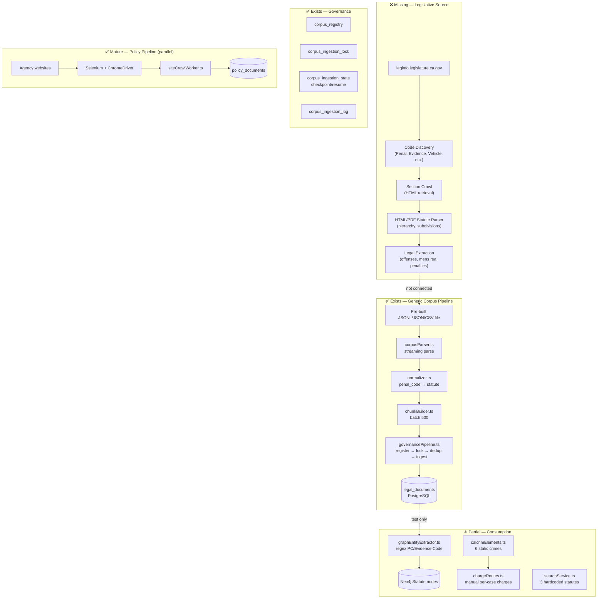

# Epic 2A — California Legislative Intelligence Engine
## Current Architecture Assessment

**Date:** 2026-07-04  
**Primary source target:** https://leginfo.legislature.ca.gov/faces/home.xhtml  
**Assessment type:** Engineering audit (no pipeline rewrite)

---

## Executive Finding

**CourtAccess does not yet have a California Legislative Intelligence ingestion pipeline.**

There are **zero references** to `leginfo.legislature.ca.gov` in the codebase. What exists is:

1. A **generic bulk corpus loader** (JSONL/JSON/CSV → normalize → PostgreSQL `legal_documents`)
2. A **corpus governance layer** (registry, locks, versioning, dedup)
3. A **policy intelligence pipeline** (agency websites, POST directory, Selenium) — mature but unrelated to statutes
4. **Static CALCRIM/offense data** (~6 crimes hardcoded)
5. A **Neo4j graph layer** (regex statute extraction) — test-only, not production-wired

The legislative engine is **infrastructure-ready, source-acquisition missing**.

---

## Architecture Diagram (Current State)



---

## Staged Pipeline (Recommended Target Architecture)

Per constitutional requirements, production legal ingestion should have distinct stages:

| Stage | Current | Target |
|-------|---------|--------|
| **1. Discovery** | ❌ None | Enumerate all CA codes, divisions, chapters, sections from leginfo TOC |
| **2. Acquisition** | ❌ None | Retrieve authoritative HTML with retry, resume, rate limiting, robots.txt |
| **3. Normalization** | ✅ File-based | Canonical `StatuteRecord` with code, section, title, full text, hierarchy |
| **4. Legal Extraction** | ❌ None | Offenses, elements, mens rea, penalties, exceptions, cross-refs |
| **5. Validation** | ⚠️ Hash dedup only | Schema validation, completeness checks, reject ambiguous parses |
| **6. Repository Update** | ✅ `legal_documents` | Statute, Offense, Element, Mens Rea, Authority, CALCRIM repos |
| **7. Coverage Analytics** | ❌ None | Per-code completion %, gap reports, failed extraction log |

---

## Pipeline Inventory by Stage

### Discovery — NOT IMPLEMENTED

| Component | Path | Status |
|-----------|------|--------|
| Leginfo code enumeration | — | Missing |
| Section URL generation | — | Missing |
| Policy analog (reference) | `backend/src/policy/taxonomy/agencyPolicyDiscovery.ts` | Exists for agencies |

### Acquisition / Crawl — NOT IMPLEMENTED (legislative)

| Component | Path | Status |
|-----------|------|--------|
| Leginfo HTTP client | — | Missing |
| Selenium page retrieval | `backend/src/policy/workers/siteCrawlWorker.ts` | Policy only |
| Crawler safety (rate limit, robots) | `backend/src/workers/crawlerSafetyService.ts` | Reusable |
| Crawl sandbox | `backend/src/workers/crawlSandbox.ts` | Reusable |
| Phase 82 crawl CLI | `backend/src/policy/pipeline/phase82_sandboxCrawl.ts` | Policy only |

### Parse — FILE FORMATS ONLY

| Component | Path | Formats |
|-----------|------|---------|
| Streaming parser | `backend/src/ingestion/corpusParser.ts` | JSONL, JSON array, CSV |
| Test corpus generator | `backend/scripts/generate-test-corpus.ts` | Synthetic statute records |
| HTML/PDF statute parser | — | **Missing** |

### Normalize — GENERIC

| Component | Path | Notes |
|-----------|------|-------|
| Normalizer | `backend/src/ingestion/normalizer.ts` | Maps `penal_code` → `statute`; SHA-256 content hash |
| Types | `backend/src/ingestion/types.ts` | `NormalizedDocument` — no section hierarchy fields |

### Validate — PARTIAL

| Component | Path | Notes |
|-----------|------|-------|
| Duplicate detector | `backend/src/governance/duplicateDetector.ts` | Content-hash dedup |
| Governance preflight | `backend/src/governance/governancePipeline.ts` | Version + lock checks |
| Dry run | `backend/src/ingestion/cli.ts` | `--dryRun` flag |
| Statute schema validation | — | **Missing** |
| Graph integrity audit | `backend/src/graph/graphIntegrityAudit.ts` | Neo4j orphans |

### Ingest / Repository — OPERATIONAL (empty)

| Component | Path | Notes |
|-----------|------|-------|
| Corpus loader | `backend/src/ingestion/corpusLoader.ts` | Prisma + PostgreSQL COPY |
| Chunk builder | `backend/src/ingestion/chunkBuilder.ts` | Default batch 500 |
| State repository | `backend/src/ingestion/ingestionStateRepository.ts` | Checkpoint/resume |
| Ingestion logger | `backend/src/ingestion/ingestionLogger.ts` | Throughput metrics |
| BullMQ queue | `backend/src/ingestion/ingestionQueue.ts` | 3 retries, 5s backoff |
| Corpus registry | `backend/src/governance/corpusRegistry.ts` | `sourceAuthority` field |
| Governance API | `backend/src/governance/governanceApi.ts` | **Not mounted in server.ts** |

### Legal Extraction / Offense Discovery — NOT IMPLEMENTED

| Component | Path | Notes |
|-----------|------|-------|
| Offense extractor | — | Missing |
| Mens rea parser | — | Missing |
| Penalty provision parser | — | Missing |
| CALCRIM linker | `backend/src/data/calcrimMapping.ts` | 2 static mappings |
| CALCRIM elements | `backend/src/data/calcrimElements.ts` | 6 static crimes |
| Charge API | `backend/src/charges/chargeRoutes.ts` | Manual per-case entry |

### Graph / Authority — TEST ONLY

| Component | Path | Notes |
|-----------|------|-------|
| Entity extractor | `backend/src/graph/graphEntityExtractor.ts` | Regex: PC, EC, etc. |
| Relationship builder | `backend/src/graph/graphRelationshipBuilder.ts` | REFERENCES, VIOLATES |
| Graph indexer | `backend/src/graph/graphIndexer.ts` | Not wired to server |
| Query engine | `backend/src/graph/graphQueryEngine.ts` | `findStatuteApplicability()` |

---

## Key Entry Points

```bash
# Generic corpus ingestion (requires pre-built file — no leginfo fetch)
cd backend && npm run ingest-corpus -- --corpus penal_code --file /path/to/corpus.jsonl [--resume] [--dryRun] [--useCopy]

# Generate synthetic test corpus (no npm script)
tsx backend/scripts/generate-test-corpus.ts 50000 /tmp/test-corpus.jsonl

# Policy pipeline (reference architecture — not legislative)
npm run phase82:crawl    # Sandbox crawl
npm run phase85-90:validate
npm run phase103-108:acquire

# Tests
cd backend && node --import tsx --test tests/ingestion.test.ts   # 29 pass, 50k throughput test
cd backend && node --import tsx --test tests/governance.test.ts
```

**CLI caveat:** Standalone `ingest-corpus` uses mock inserter unless integrated via library API with real Prisma deps.

---

## Database State (Verification Environment)

```sql
SELECT COUNT(*) FROM legal_documents;   -- 0
SELECT COUNT(*) FROM corpus_registry;   -- 0
```

No California statutes have been ingested into the production database schema.

---

## Reusable Infrastructure (Policy → Legislative Adaptation)

The policy pipeline provides proven patterns CourtAccess can adapt:

| Pattern | Policy implementation | Legislative application |
|---------|----------------------|------------------------|
| Rate limiting | `crawlerSafetyService.ts` (1 req/sec/domain) | leginfo respectful crawl |
| Retry/resume | `ingestionStateRepository.ts` | Section-level checkpoint |
| BullMQ workers | `siteCrawlWorker.ts` | `leginfoCrawlWorker.ts` |
| Phase scripts | `phase82-128` pipeline | Legislative phase equivalents |
| Sandbox crawl | `crawlSandbox.ts` | Leginfo sandbox before production |
| Content hash dedup | `duplicateDetector.ts` | Skip unchanged sections |
| Versioning | `corpusVersioning.ts` | Statute edition tracking |
